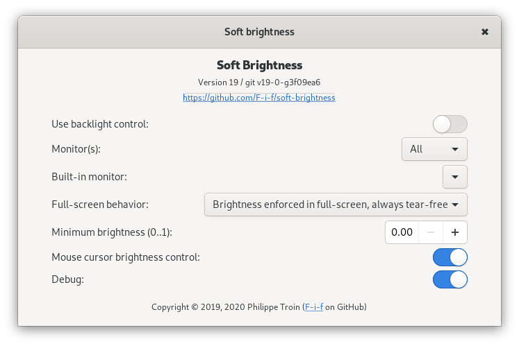

# Soft Brightness Gnome Shell Extension

[](https://travis-ci.org/F-i-f/soft-brightness)


## Overview

Soft Brightness uses an alpha overlay to control the brightness on all
or some of your monitors.  It integrates smoothly and does not
interfere with other Gnome Shell features.  It works flawlessly with
the _Night Light_, the _Magnifier_ from the Accessibility Services, or
with screen captures (as long as they are initiated by Gnome Shell).

Common uses are:

- Your laptop has no back-light, maybe because it's not supported, or
  you have an OLED display.

- You want to control the brightness level of external monitor like
  you do with your built-in screen.

Bonus features:

- Minimum brightness level: do not get lost in the dark.

- Can operate the shell in tear-free (VSync) mode at all time.

- Disables itself temporarily when a screen shot is taken.

## Known Issues with Gnome-Shell 40.0:

Gnome Shell 40.0 has a bug in the cursor handling that prevents Soft
Brightness from applying the brightness to the mouse cursor.

On Gnome Shell 40.0, the cursor will always show up at full brightness
until the issue is addressed (and the extension is updated).

- [Gnome Gitlab issue
#3980](https://gitlab.gnome.org/GNOME/gnome-shell/-/issues/3980).

## Configuration

Soft Brightness comes with a configuration panel, which can be
accessed from the "Tweaks" application or the [Gnome Shell Extensions
page](https://extensions.gnome.org/local/).



### Configuration Settings

#### _Use backlight control_

When enabled, Soft Brightness will work together with your computer's
back-light.  The brightness slider and keyboard brightness hotkeys
will control both the back-light and the Soft Brightness overlays.
This is most useful:

- if you have a back-light and  _Monitors_ is set to _External_, or

- if a back-light is detected by Gnome but is not working (like some
  OLED panel laptops which report having a back-light brightness which
  doesn't exist).  In that latter case _Monitors_ should be set to
  _All_.

If _Use backlight control_ is disabled, the Brightness slider will
only control the Soft Brightness overlays.  The keyboard brightness
hotkeys will keep their default bindings.

#### _Monitor(s)_

- If set to _All_, a brightness overlay will be added to all attached
  monitors.

- If set to _Built-in_, the brightness overlay will only be added to
  the built-in monitor, which is the setting right below _Monitor(s)_.

- If set to _External_, a brightness overlay will only be added to all
  monitors which are not the built-in monitor, defined in the setting
  right below _Monitor(s)_.

#### _Built-in monitor_

A list of currently attached monitors is displayed.  Pick from the
list which monitor should be considered the built-in monitor.

The setting only has an effect if _Monitor(s)_ is set to _Built-in_ or
_External_.

#### _Full-screen behavior_

Choose one of:

- _Do not enforce brightness in full-screen_: When an application
  enters full-screen mode, remove the brightness overlays.  You may
  want to try this setting if your applications' refresh rate is
  lagging in full-screen.  The application will
  [unredirect](https://passthroughpo.st/linux-desktop-compositors-performance-functionality)
  its window and will bypass Gnome Shell's compositing (this is the
  default for full-screen applications in Gnome Shell unless changed
  by another extension).

- _Brightness enforced in full-screen_: The brightness overlay stays
  active when an application enters full-screen mode.  This also
  prevents the app from unredirecting its window (its surface will be
  composited with Gnome Shell, and as a side-effect, will be subjected
  to vertical refresh synchronization, ensuring tear-free rendering).
  This is the default.

- _Brightness enforced in full-screen, always tear-free_: Works like
  _Brightness enforced in full-screen_, but will still prevent
  full-screen applications from unredirecting their windows even if no
  brightness overlay is active (brightness is 100%).  Applications
  will then always be rendered
  [tear-free](https://en.wikipedia.org/wiki/Screen_tearing), whatever
  the brightness may be. In this mode, Soft Brightness can be used as
  a replacement for extensions like _Fix Fullscreen Tearing_.

#### _Minimum brightness_

Sets the minimum allowable brightness for the display where _0_ is
completely dark and _1_ completely bright. Defaults to _0.1_ (10%).

The minimum brightness will also be enforced for the panel back-light
if _Use backlight control_ is on.

When the brightness is set to 0%, the display will go completely dark,
it may be hard to reset the brightness with the slider then.

#### _Mouse cursor brightness control_

Toggles between having the mouse cursor brightness follow the screen
brightness (on/_true_) and keeping the mouse cursor at full brightness
(off/_false_).

Gnome Shell's handling of cursor tracking can be sometimes buggy and
can show the wrong cursor type or size when the mouse cursor
brightness follows the screen brightness.  It also introduces some
pointer motion lag.

Note that if an other Gnome Shell component enables mouse tracking
(for example the Zoom accessibility option), then the mouse cursor
brightness will always follow the screen's.

#### _Debug_

When toggled on, Soft Brightness will log extra debugging information
to the system journal (or syslog).

This will be useful if you encounter a bug:  In that case, please turn
_Debug_ on, and try to reproduce the issue with that setting before
capturing the debug logging.

Soft Brightness's debug messages can be watched with:

```
journalctl -f | grep 'gnome-shell.*Soft-Brightness'
```

### Effect on power consumption

Soft Brightness will cause extra load on the hardware and therefore
slightly increase power usage, as it needs to add extra alpha layers
and track the mouse among other things.  This is true of any Gnome
Shell extension.

If Soft Brightness controls an LCD panel, changing the brightness will
not change at all the panel's power consumption.  Use the back-light
instead:  Changing the back-light brightness will affect power
consumption, the lower the brightness, the lower the power usage.

If Soft Brightness controls an OLED panel, changing the brightness
will affect power consumption, the lower the brightness, the lower the
power usage.

### Common use cases and usage scenarios

#### You have a desktop computer

Soft Brightness can be used to control the brightness of all your
attached monitors:

- Set _Use backlight control_ to _Off_.

- Set _Monitor(s)_ to _All_.

#### You have a laptop computer with a back-light

You can leave the control of your attached display to the back-light
and use Soft Brightness to control the brightness of external
displays:

- Set _Use backlight control_ to _On_.

- Set _Monitor(s)_ to _External_.

- Configure _Built-in monitor_ to your built-in panel's name.

#### You have a laptop computer without a back-light

For example an OLED panel or non-functional back-light.  Have
Soft-Brightness control the brightness for all your monitors:

- Set _Use backlight control_ to _On_.

- Set _Monitor(s)_ to _All_.

## License

Soft Brightness is free software: you can redistribute it and/or
modify it under the terms of the GNU General Public License as
published by the Free Software Foundation, either version 3 of the
License, or (at your option) any later version.

This program is distributed in the hope that it will be useful, but
WITHOUT ANY WARRANTY; without even the implied warranty of
MERCHANTABILITY or FITNESS FOR A PARTICULAR PURPOSE.  See the GNU
General Public License for more details.

You should have received a copy of the GNU General Public License
along with this program.  If not, see [http://www.gnu.org/licenses/].

## Download / Install

Install directly from the [Gnome Shell Extensions
site](https://extensions.gnome.org/extension/1625/soft-brightness/).

Or download the zip file from the GitHub [releases
page](https://github.com/F-i-f/soft-brightness/releases) and unzip
[the
file](https://github.com/F-i-f/soft-brightness/releases/download/v28/soft-brightness@fifi.org.v28.shell-extension.zip)
in the
`~/.local/share/gnome-shell/extensions/soft-brightness@fifi.org`
directory (you may have to create the directory).

## Building from source

### Requirements

- [meson](http://mesonbuild.com/) v0.44.0 or later.

### Running the build

- Check out: `git clone https://github.com/F-i-f/soft-brightness`

- `cd soft-brightness`

- Run meson: `meson build`

- To install in your your gnome shell extensions' directory (~/.local/share/gnome-shell/extensions), run ninja: `ninja -C build install`

- To build the extension zip files, run: `ninja -C build extension.zip`, the extension will be found under `build/extension.zip`.

## Changelog

### Version 28
#### December 18, 2021

- Gnome Shell 41 compatibility.
- Update meson-gse to latest:
  - Bugfix for preferences logging.
- Add Dutch translation (courtesy of @Vistaus).

### Version 27
#### March 25, 2021

- Gnome-shell 40.0 compatibility.
- Update preferences for Gnome-shell 40.0.
- Disable mouse cloning on Gnome-shell 40 and later.
- Update meson-gse to latest:
  - Now prints the GJS version in the system log at start-up (if debug
	is enabled).
  - Support more mozjs version (78, 68, 52) for build-time syntax
	checks (`ninja test`).

### Version 26
#### November 12, 2020

- Fix mouse cursor offset bug on GS 3.38.

### Version 25
#### October 30, 2020

- Added Persian translation.

### Version 23, 24
#### October 29, 2020

- Added Turkish translation.

### Version 22
#### October 28, 2020

- GS 3.38 compatibility: CursorSprite.set_anchor_point has been removed.

### Version 21
#### October 8, 2020

- Only disable mouse tracking on Gnome-Shell 3.38 when gjs 1.65 up to
  1.66.0 inclusive are detected.
- Report gjs version in log.

### Version 20
#### October 6, 2020

- Kludgy work-around a Gnome-Shell bug where mouse tracking doesn't
  generate events by delaying the mouse tracking initialization after
  the extension has loaded.
- Disable mouse tracking on Gnome-Shell 3.38 until [Gnome-Shell Issue
  #3237](https://gitlab.gnome.org/GNOME/gnome-shell/-/issues/3237) is
  fixed.
- Support Gnome-Shell 3.38.

### Version 19
#### April 24, 2020

- Add a preference for toggling mouse cloning.
- Fix typos.
- Update French translation.

### Version 18
#### March 12, 2020

- Fix Gnome-shell 3.34 cursor tracking broken on Wayland
- Enhance cursor tracking performance regression on GS >= 3.34
  introduced in version 16.

### Version 17
#### March 11, 2020

- Gnome-shell 3.36 compatibility.
- Fix deprecation warning in preferences.
- Update meson-gse to latest.

### Version 16
#### March 10, 2020

- Re-enable mouse cloning on Wayland GS >= 3.34.1 (work-around only
  active for 3.33.90 < GS < 3.34.1).
- Added Czech translation (thanks to p-bo on GitHub).
- Fix annoying bug on GS 3.34 where the brightness slider will creep
  back to 100% whenever changed to something lower (only when using
  backlight control).

### Version 15
#### October 27, 2019

- Now compatible with GS 3.34 and GS 3.35.1.
- Do not clone mouse on GS > 3.33.90 when running under Wayland
  (work-around [Mutter issue
  #826](https://gitlab.gnome.org/GNOME/mutter/issues/826)).
- Minor code clean-ups.
- Show GS version and session type (Wayland/X11) at start-up when
  debugging.

### Version 14
#### August 21, 2019

Fixed broken version 13 update.
- Fix slider not up-to-date at start on GS 3.33.90.
- Fix broken GS 3.32 compatibility code.

### Version 13
#### August 19, 2019

- _Note that this version is broken._  Please use versions 12 (on
  Gnome-Shell 3.32 and lower), or version 14 (all Shell versions).
- Gnome-shell 3.33 compatibility.

### Version 12
#### April 23, 2019

- Fix Drag-n-Drop (eg. in Overview).

### Version 11
#### April 23, 2019

- Fix bug where the cursor sprite changes were not tracked correctly
  on Gnome Shell 3.28.
- Fix regression crash by infinite recursion when attempting to "Use
  backlight" without a hardware backlight.  If that happens, the
  extension will use its internal setting for the brightness value.

### Version 10
#### April 23, 2019

- Fix extension errors on Gnome Shell 3.32.
- Fix cursor disappearing when external monitors are plugged in or the
  _Monitor(s)_ preference setting is changed.
- Fix flickering on Gnome Shell 3.32 when mouse hovers non-overlaid
  display sections but overlays are active on other monitors.
- Fix mouse still being tracked unnecessarily when the overlays should
  activate but don't because the monitors they would apply to are not
  connected.
- Gnome Shell 3.28 compatibility.
- Expand documentation.

### Version 9
#### April 20, 2019

- The mouse pointer is now affected by the brightness.
- Better & simpler Magnifier handling.
- Fix bugs.
- Improved code maintainability.

### Version 8
#### April 16, 2019

- Remove the overlay during screenshots: they are now unaffected by
  the brightness setting.
- Keep the brightness setting when the magnifier (aka. Universal
  Access Magnifier/Zoom) is on.
- Fix bugs.

### Version 7
#### March 30, 2019

- Fix warning in logger.js that was introduced in version 6.

### Version 6
#### March 26, 2019

- ES6 / Gnome-Shell 3.32 compatibility (still compatible with 3.30 and lower).
- Updated meson-gse to latest.
- Minor doc updates.

### Version 5
#### March 24, 2019

- Updated meson-gse to latest.
- Fix extension error on disable.
- Fix extension error on enable-disable-enable.
- Minor non-user visible, internal changes to preferences dialog.
- Minor doc updates.

### Version 4
#### February 11, 2019

- README.md: Meson 0.44.0 or later is required.
- README.md: Add credits.
- Drop duplicate shipped file in lib/convenience.js.
- Add GPLv3 in LICENSE.
- Use meson-gse for building: custom scripts moved there.
- Fix french translations not showing up.
- Beautify preferences dialog.
- Fix a few strings for consistency.
- Fix wrong gettext-domain in schema file.
- Remove all global variables from extension.

### Version 3
#### February 6, 2019

- Moved to git.
- Use meson for builds, restructure source tree.
- Added internationalization, and french translation.
- Added LICENSE and README.md files.
- Show git revision in debug logging.
- Brightness overlays now mask the entire desktop, including transients.
- Brightness overlays don't prevent DND actions in the overview anymore.
- Fix a couple of typos.

### Version 2
#### February 5, 2019

- The extension now removes the standard brightness control and puts its own in place (as opposed to trying to monkey patch the existing control).

- Handle external/built-in monitor.

- Control what happens in full-screen.

#### Notes

The git release shows as 3 in the source code, but the extension (as built by the [Gnome Shell Extensions website](https://extensions.gnome.org/)) shows the release at 2.
Let's call it release 2 then.

### Version 1
#### February 2, 2019

First public release.

## Credits

- The [`meson-gse` credits](https://github.com/F-i-f/meson-gse/) are
  included here by reference.

<!--  LocalWords:  OLED VSync extensions' Changelog README md GPLv3 X11
 -->
<!--  LocalWords:  gse gettext DND js ES6 backlight applications' syslog
 -->
<!--  LocalWords:  unredirect compositing unredirecting composited eg
 -->
<!--  LocalWords:  fullscreen merchantability Wayland Xorg gdm Gitlab
 -->
<!--  LocalWords:  bo kludgy gjs CursorSprite mozjs
 -->
